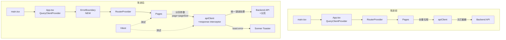
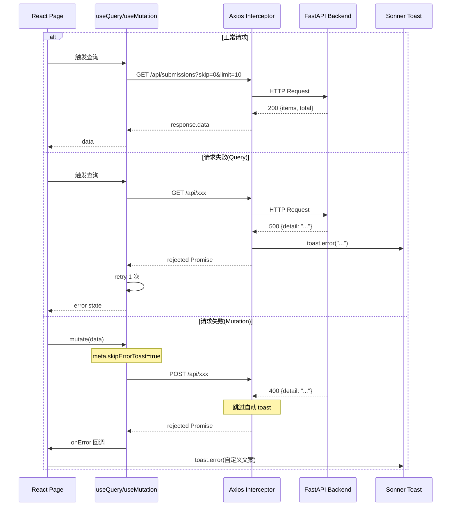

## 用户需求

基于前端设计分析报告中的改进建议，排除"暗色模式"项，对剩余 5 项问题设计可执行的改进方案。

## 产品概述

对现有 AI 作业批改系统前端进行工程化改进，涵盖错误边界、API 统一错误处理、后端分页、单元测试、基础修缮五个维度，提升系统健壮性与可维护性。

## 核心功能

1. **全局 Error Boundary**：在 App 根组件包裹 ErrorBoundary，捕获未处理渲染异常，展示友好降级 UI 并提供重新加载入口，避免白屏
2. **Axios 响应拦截器**：在 apiClient 上注册 response interceptor，统一提取后端错误信息（FastAPI detail 字段），按 HTTP 状态码分类处理（401/403/404/500 等），配合 sonner toast 全局提示；同时优化 QueryClient 默认 retry 策略
3. **后端分页支持**：后端 `/submissions` 接口增加 `skip`/`limit` 分页参数并返回 `{items, total}` 结构；前端 `useSubmissions` 改为携带分页参数查询，HistoryPage 分页器改为后端驱动，轮询逻辑适配分页数据结构
4. **单元测试基础设施**：引入 Vitest + @testing-library/react + jsdom，配置 vitest.config.ts 与测试 setup 文件，编写首批测试覆盖 cn 工具函数、submission 状态判断函数、StatusBadge 组件渲染
5. **基础修缮**：修正 index.html title 为"AI 作业批改"，删除空文件 App.css 及其引用

## 技术栈

- 前端：React 19 + Vite 8 + TypeScript 6 + Tailwind CSS 4 + TanStack Query 5 + shadcn/ui + sonner + axios
- 后端：FastAPI + SQLAlchemy（分页改动涉及）
- 测试：Vitest 3 + @testing-library/react + jsdom（新增）

## 实现方案

### 1. 全局 Error Boundary

React 标准 class component 实现 `componentDidCatch`，在 `App.tsx` 的 `QueryClientProvider` 内层包裹 `RouterProvider`，捕获渲染异常后展示居中错误卡片（复用现有 Card + Button 组件 + AlertCircle 图标），提供"刷新页面"按钮。不引入额外依赖。

### 2. Axios 响应拦截器

在 `api/client.ts` 中为 `apiClient` 添加 `interceptors.response.use`：

- **成功**：直接返回 response
- **失败**：提取 `error.response?.data?.detail`（FastAPI 标准错误格式）或 `error.message` 作为友好信息；对 401/403 提示权限相关文案；对网络超时单独处理；通过 `sonner.toast.error()` 全局展示
- **QueryClient 优化**：添加 `queries.retry: 1`（默认不重试容易导致错误体验差），`queries.retryDelay: 1000`，避免轮询场景下无限重试
- **注意**：拦截器内调用 toast 需确保 sonner 已挂载（Toaster 在 App.tsx 中与拦截器同模块层级，sonner 的 toast 函数不依赖 React 组件树即可调用，满足时序要求）

### 3. 后端分页

**后端改动**（`backend/app/api/submissions.py` + `backend/app/schemas/submission.py`）：

- 新增 `PaginatedSubmissions` schema：`{items: list[SubmissionOut], total: int, skip: int, limit: int}`
- `list_submissions` 接口签名增加 `skip: int = 0, limit: int = 10` query 参数
- 使用 SQLAlchemy `.offset(skip).limit(limit)` 分页，`select(func.count())` 获取总数
- **向后兼容**：保持默认值，不传参时等价于首页 10 条

**前端改动**（`frontend/src/api/submissions.ts` + `frontend/src/pages/HistoryPage.tsx`）：

- `useSubmissions` 改为接收 `{page, pageSize}` 参数，queryKey 包含分页参数
- 返回类型改为 `PaginatedSubmissions`，轮询判断改为检查 `data.items` 中是否有非终态记录
- HistoryPage 移除前端 `useMemo slice` 逻辑，`totalPages` 从 `data.total` 计算，`rows` 改为 `data.items`

### 4. 单元测试

**配置**：

- `package.json` devDependencies 添加 `vitest`、`@testing-library/react`、`@testing-library/jest-dom`、`jsdom`
- `package.json` scripts 添加 `"test": "vitest"`、`"test:run": "vitest run"`
- 新建 `frontend/vitest.config.ts`：引用 `@vitejs/plugin-react`，test.environment = jsdom，setupFiles 指向 `src/test/setup.ts`
- 新建 `frontend/src/test/setup.ts`：导入 `@testing-library/jest-dom/vitest`
- `tsconfig.app.json` 或单独 `tsconfig.json` 的 `types` 字段添加 `"vitest/globals"`

**首批测试文件**：

- `src/lib/__tests__/utils.test.ts`：cn 函数类名合并、冲突覆盖
- `src/api/__tests__/submissions.test.ts`：isTerminal / isProcessing 状态判断
- `src/pages/__tests__/HistoryPage.test.tsx`：StatusBadge 各状态渲染、空态展示

### 5. 基础修缮

- `index.html`：`<title>frontend</title>` → `<title>AI 作业批改</title>`
- 删除 `src/App.css`（空文件）及 `App.tsx` 中可能存在的引用（当前 App.tsx 未引用，main.tsx 引用 index.css，无需改 main）

## 实现备注

- **性能**：后端分页避免全量传输，减少序列化开销；QueryClient retry 限制为 1 次避免轮询场景下放大请求量
- **日志**：拦截器内 `console.error` 记录完整 error 对象用于调试，toast 仅展示友好信息不泄露堆栈
- **影响范围控制**：分页接口保持默认参数向后兼容，旧调用方（如轮询逻辑）需同步适配新返回结构；ErrorBoundary 仅包裹渲染层不影响数据层逻辑；拦截器对已有页面中 `try/catch + toast.error` 的双重提示需要评估——方案选择拦截器不阻断 mutation onError 回调（页面级 onError 仍会执行，但拦截器的 toast 会先触发），为避免重复 toast，拦截器仅对非 mutation 的 query 请求自动 toast，mutation 错误仍由各页面 onError 处理。实现方式：拦截器通过自定义 config 标记 `skipErrorToast` 区分，mutation 调用时传入 `{ meta: { skipErrorToast: true } }`

## 目录结构

```
frontend/
├── index.html                                    # [MODIFY] title 改为"AI 作业批改"
├── vitest.config.ts                              # [NEW] Vitest 配置，jsdom 环境 + react 插件
├── package.json                                  # [MODIFY] 添加 vitest 等 devDeps + test scripts
├── tsconfig.app.json                             # [MODIFY] types 字段添加 vitest/globals（可选）
├── src/
│   ├── App.css                                   # [DELETE] 空文件，清理
│   ├── App.tsx                                   # [MODIFY] 包裹 ErrorBoundary
│   ├── api/
│   │   ├── client.ts                             # [MODIFY] 添加响应拦截器 + QueryClient retry 策略
│   │   └── submissions.ts                        # [MODIFY] useSubmissions 改为分页查询，新增 PaginatedSubmissions 类型
│   ├── components/
│   │   └── ErrorBoundary.tsx                     # [NEW] React class component，捕获渲染异常，降级 UI
│   ├── pages/
│   │   └── HistoryPage.tsx                       # [MODIFY] 移除前端分页 slice，改用后端分页数据
│   ├── test/
│   │   └── setup.ts                              # [NEW] 测试全局 setup，导入 jest-dom matchers
│   ├── lib/
│   │   └── __tests__/
│   │       └── utils.test.ts                     # [NEW] cn 函数测试
│   ├── api/
│   │   └── __tests__/
│   │       └── submissions.test.ts               # [NEW] isTerminal/isProcessing 状态判断测试
│   └── pages/
│       └── __tests__/
│           └── HistoryPage.test.tsx              # [NEW] StatusBadge 组件渲染测试
├── backend/
│   └── app/
│       ├── api/submissions.py                    # [MODIFY] list_submissions 增加 skip/limit 分页参数
│       └── schemas/submission.py                 # [MODIFY] 新增 PaginatedSubmissions schema
```

## 架构设计



改进后的请求-错误处理流程：



## 关键代码结构

### PaginatedSubmissions 类型定义（前后端共享语义）

```typescript
// frontend/src/api/submissions.ts

export interface PaginatedSubmissions {
  items: SubmissionOut[];
  total: number;
  skip: number;
  limit: number;
}
```

### ErrorBoundary 组件签名

```typescript
// frontend/src/components/ErrorBoundary.tsx

interface ErrorBoundaryState {
  hasError: boolean;
  error?: Error;
}

export class ErrorBoundary extends React.Component<
  { children: React.ReactNode },
  ErrorBoundaryState
> {
  // static getDerivedStateFromError(error: Error): ErrorBoundaryState
  // componentDidCatch(error: Error, info: React.ErrorInfo): void
  // render(): 降级 UI 或 children
}
```

### Axios 拦截器错误处理签名

```typescript
// frontend/src/api/client.ts

interface ApiErrorResponse {
  detail?: string;
}

// apiClient.interceptors.response.use(
//   (response) => response,
//   (error: AxiosError<ApiErrorResponse>) => { ... }
// )
```

## Agent Extensions

### SubAgent

- **code-explorer**
- Purpose: 在实现阶段需要跨多文件搜索确认后端分页改动影响范围、确认 App.css 是否有其他引用时使用
- Expected outcome: 确认改动影响范围完整，无遗漏的引用或调用点